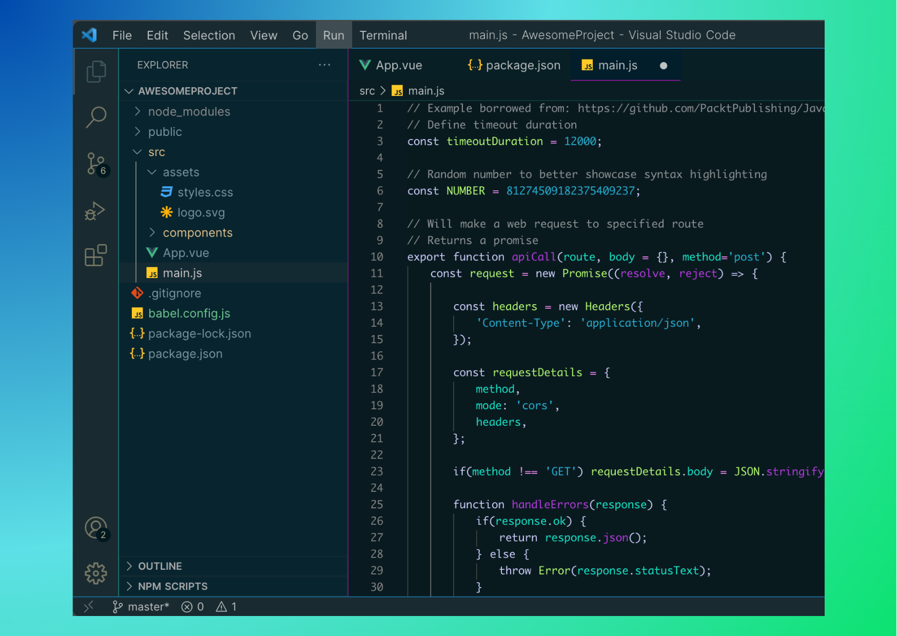

# Warp Cyber Wave

The color theme inspired by Warp's Cyber Wave theme!

## Screenshots

### The theme(half-size)

### The theme(whole-size)

### Javascript

## JSX

## CSS

## For more information

* [Visual Studio Code's Markdown Support](http://code.visualstudio.com/docs/languages/markdown)
* [Markdown Syntax Reference](https://help.github.com/articles/markdown-basics/)

**Enjoy!**
